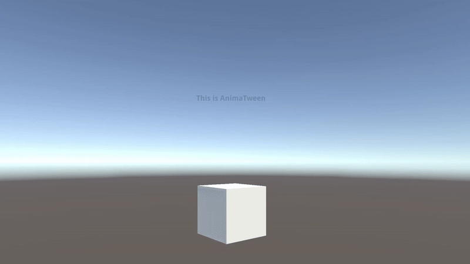

# AnimaTween

**AnimaTween** – The animation tween you see in any game engine.
A simple and flexible way to animate fields and properties of your objects directly in Unity.

Say goodbye to complex setups and hello to smooth, code-driven animation. The API design is heavily inspired by the beloved libraries of the Defold engine.

[](https://youtu.be/nTCLchP_ZNk)

---

## 📦 Installation

1. Open Unity and go to **Window → Package Manager**.
2. Click the **+** button → **Add package from git URL...**
3. Paste the repository URL:

   ```
   https://github.com/EsdrasCaleb/AnimaTween
   ```
4. Click **Add** to install.

---

## 🚀 Usage

Once installed, simply import the namespace and call `AnimaTween` on any supported object.

**Example:**

```csharp
using UnityEngine;
using AnimaTween; // Important!

public class GameManager : MonoBehaviour
{
    public PlayerData playerData;
    public TMPro.TMP_Text scoreText;

    void Start()
    {
        // Animates the 'score' variable from 'playerData' to 1000 over 3 seconds.
        // When finished, calls the UpdateText function.
        playerData.ATween("score", 1000, 3.0f, onComplete: UpdateText);
    }

    void Update()
    {
        // The text will be updated dynamically during the animation
        UpdateText();
    }

    void UpdateText()
    {
        scoreText.text = "Score: " + playerData.score;
    }
}
```

---

## 📖 How it works

* `AnimaTween` takes the name of a **field** or **property** as a string and animates its value over time.
* Supports **float**, **int**, **Vector2**, **Vector3**, and other numerical types.
* Executes an optional callback (`onComplete`) when the animation finishes.

-----

## 📚 Documentation

### Functions

#### Main Animation Function

The most versatile function, capable of animating any property or public field of an object.

```csharp
Target.ATween(string propertyName, object toValue, float duration, 
           Easing easing = Easing.Linear, Action onComplete = null, 
           Playback playback = Playback.Forward, object fromValue = null)
```

#### Shortcut Function

A pre-configured function for a common task.

```csharp
// Anima a transparência (alpha) de componentes visuais comuns.
Component.AFade(float duration, Easing easing = Easing.Linear, 
             Action onComplete = null, float toAlpha = 0)
```

#### Timer Functions ⏰

Execute code after a delay, with the option to retry.

```csharp
// Executa um callback após um atraso. Pode também ser usado para criar um intervalo repetido.
Target.ATimeout(float time, Action callback, bool repeat = false)
```

-----

### Parameters

#### `ATween`

This is AnimaTween's main function. Here are the details of its parameters:

* **`Target`**: The object containing the field or property to be animated.

* **`propertyName`**: The name of the field or property (as a string).

  * **`toValue`**: The animation's target value. This is a versatile parameter that accepts different input types.

    <details>
    <summary><strong>▶️ Supported Value Types</strong></summary>

    You can animate any public field or property of the following types:

    - **`float`**: For single numeric values (e.g., `alpha` of a CanvasGroup, velocity).
      - **`int`**: For integer values. The animation will occur with rounding.
      - **`Vector2`**: For 2D positions, scales, etc.
      - **`Vector3`**: For 3D positions, scales, Euler angles, etc.
      - **`Color`**: For animating colors of materials, images, sprites, etc.
      - **`Quaternion`**: For rotations. Uses `Quaternion.Slerp` for smooth interpolation.
    - **`string`**: Creates a typewriter effect.

      </details>

      <details>
      <summary><strong>▶️ Path Animation (Waypoints)</strong></summary>

      Instead of a single value, you can provide a collection (List<T> or T[]) of any supported type to create a path animation. The duration will be distributed equally across the path segments.

     **Example:** Making an object move through three points.

      ```csharp
      var path = new Vector3[]
      {
          new Vector3(5, 0, 0),
          new Vector3(5, 5, 0),
          new Vector3(0, 5, 0)
      };

      // It will take 3 seconds to complete the entire path (1s per segment).
      transform.ATween("position", path, 3f); 
      ```

      </details>

* **`duration`**: The duration of the animation in seconds.

* **`easing`**: The acceleration curve of the animation (see the **Easing Values** section).

* **`onComplete`**: An optional callback that is executed when the animation ends (not called in loops).

* **`playback`**: The playback mode of the animation (see the **Playback Modes** section).

* **`fromValue`** (Optional): Forces the animation to start from this value instead of the current value of the property.
-----

### Control Functions 🎮

Control the lifecycle of your animations and timers after they've started.

| Function | Description | Final State | Execute Callback? |
|:---|:---|:---|:---|
| **`AComplete`** | **Completes** the tween, jumping to its final state. | End or Start | **Yes** (default) |
| **`AStop`** | **Stops** the tween immediately, freezing it in place. | Current Value | **No** |
| **`ACancel`** | **Cancels** the tween, reverting to its initial state. | Initial Value | **No** |
| **`ACompleteTimer`** | **Completes** the timer, triggering its callback. | - | **Yes** (default) |

<details>
<summary><strong>▶️ Control Function Details</strong></summary>

#### **`AComplete`**

Completes one or all tweens on a target, jumping to a specified end state and triggering their callbacks.

```csharp
Target.AComplete(string propertyName = null, bool withCallback = true, EndState endState = EndState.End)
```

* `propertyName`: The specific tween to complete. If `null`, completes **all** tweens in the target.
* `withCallback`: If `true` (default), the tween's `onComplete` callback will be executed.
* `endState`: Determines where the property jumps to. Use `EndState.End` (default) to jump to the toValue, 
`EndState.Start` to jump to the fromValue, or `EndState.Middle` to remain at the current value.

#### **`AStop`**

Stops one or all tweens on a target, leaving them in their current state.

```csharp
Target.AStop(string propertyName = null)
```

* `propertyName`: The specific tween to stop. If `null`, stops **all** tweens in the target.

#### **`ACancel`**

Cancel one or all tweets in a target, reverting them to their initial state.

```csharp
Target.ACancel(string propertyName = null)
```

* `propertyName`: The specific tween to cancel. If `null`, cancels **all** tweens in the target.

#### **`ACompleteTimer`**

Completes a specific timer or all timers on a target.

```csharp
Target.ACompleteTimer(int timerId = -1, bool withFinalCallback = true)
```

* `timerId`: The ID of the timer to complete (returned by `ATimeout`). If `-1` (default), completes **all** timers in the target.
* `withFinalCallback`: If `true` (default), the timer callback will be executed.
</details>

-----

### Playback Modes

The `playback` parameter defines how `ATween` behaves over time.

| Mode | Behavior | Description |
|:---|:---|:---|
| `Forward` | 🏃 A → B | **(Default)** Animates from the start value to the end value and stops. |
| `Backward` | ◀️ B → A | Animates from the end value to the start value and stops. |
| `PingPong` | 🏓 A → B → A | Animates from the start to the end, then loops back to the start and stops. |
| `LoopForward` | 🔁 A → B, A → B... | Repeats the animation from start to finish indefinitely. |
| `LoopBackward` | 🔁 B → A, B → A... | Repeats the animation from end to start indefinitely. |
| `LoopPingPong` | 🔄 A → B → A, A → B → A... | Repeats the "back and forth" animation indefinitely. Ideal for pulsating effects. |

**Note:** The `onComplete` callback **is** not called for *Loop* modes, as they, by definition, never end.

-----

### Easing Values

A list of all available easing curves.

<details>
<summary><strong>▶️ List of Easing Values </strong></summary>

```
InBack, InBounce, InCirc, InCubic, InElastic, InExpo,
InOutBack, InOutBounce, InOutCirc, InOutCubic, InOutElastic, InOutExpo,
InOutQuad, InOutQuart, InOutQuint, InOutSine,
InQuad, InQuart, InQuint, InSine,
Linear,
OutBack, OutBounce, OutCirc, OutCubic, OutElastic, OutExpo,
OutInBack, OutInBounce, OutInCirc, OutInCubic, OutInElastic, OutInExpo,
OutInQuad, OutInQuart, OutInQuint, OutInSine,
OutQuad, OutQuart, OutQuint, OutSine
```

</details>

See a visual representation of each easing curve here:
➡️ **[Visual Easing Reference](https://easings.net/)** (an excellent visual resource for understanding each curve)

-----

### 💻 Usage Examples


**1. Move a `Transform` to a new position:**

```csharp
public Transform playerTransform;

void Start() {
    Vector3 targetPosition = new Vector3(10, 0, 0);
    playerTransform.ATween("position", targetPosition, 2.0f, Easing.OutBack);
}
```

**2. Make a warning icon pulse using `LoopPingPong`:**

```csharp
public Transform warningIcon;

void Start() {
    // The icon will continuously scale up and down.
    warningIcon.ATween("localScale", Vector3.one * 1.2f, 0.7f, Easing.InOutSine, Playback.LoopPingPong);
}
```

**3. Fade out a UI Image and then disable it:**

```csharp
public Image myImage;

void HideImage() {
    myImage.AFade(Easing.OutQuad, () => {
        // This code will be executed when the fade completes.
        myImage.gameObject.SetActive(false);
    });
}
```

**4. Animate a score value and update the text upon completion:**

```csharp
public Text scoreText;
public int currentScore = 0;

void AddPoints(int pointsToAdd) {
    int newScore = currentScore + pointsToAdd;
    // Animate the "invisible" 'currentScore' value
    this.ATween(nameof(currentScore), newScore, 1.0f, Easing.OutCubic, onComplete: UpdateScoreText);
}

void UpdateScoreText() {
    scoreText.text = "Score: " + currentScore;
}
```

**5. Stop a specific animation:**

```csharp
// At some point, the player enters a cutscene and needs to stop moving.
playerTransform.AComplete("position");
```

**6. Simple Timeout**
Run a piece of code once after 2.5 seconds.

```csharp
void Start()
{
    // 'this' refers to the current MonoBehaviour instance.
    this.ATimeout(2.5f, () => 
    {
        Debug.Log("Timeout finished!");
    });
}
```

**7. Repeating Interval**
Spawn a prefab every second, indefinitely.

```csharp
public GameObject prefabToSpawn;

void Start()
{
    // Create an interval that fires every 1.0 second.
    this.ATimeout(1.0f, () =>
    {
        Instantiate(prefabToSpawn, Vector3.zero, Quaternion.identity);
        Debug.Log("Prefab spawned!");
    }, repeat: true);
}
```

**8. Stopping All Timers on an Object**
This example starts a repeating interval and then schedules a separate timeout to stop **all** timers on that object after 5 seconds.

```csharp
void Start()
{
    // Start the repeating interval.
    this.ATimeout(() =>
    {
        Instantiate(prefabToSpawn, Vector3.zero, Quaternion.identity);
    }, repeat: true);

    // Schedule a one-shot timeout to stop all timers on this object later.
    this.ATimeout(5.0f, () =>
    {
        Debug.Log("Stopping all repeating timers now.");
        this.ACompleteTimers(); // This stops every timer on the object.
    });
}
```

**9. Stopping a Specific Timer**
This example shows how to capture a timer's ID and stop only that specific timer, leaving other timers on the same object running.

```csharp
// Class variable to store the ID of the timer we want to control.
private int _blinkingTimerId;

void Start()
{
    // Start a repeating interval and STORE its returned ID.
    _blinkingTimerId = this.ATimeout(0.5f, () =>
    {
        Debug.Log("Blink effect is running...");
        // Code to make a sprite blink...
    }, repeat: true);

    // Start a second, different timer that will not be affected.
    this.ATimeout(1.0f, () => Debug.Log("Health regen tick..."), repeat: true);

    // After 4 seconds, stop ONLY the blinking timer using its stored ID.
    this.ATimeout(4.0f, () =>
    {
        Debug.Log($"Stopping only the blink effect (ID: {_blinkingTimerId}).");
        this.ACompleteTimer(_blinkingTimerId); // The other timer will keep running.
    });
}
```

## 📝 License

This project is licensed under the **MIT License** – free to use for any purpose, including commercial, with attribution.
See the [LICENSE](LICENSE) file for details.
